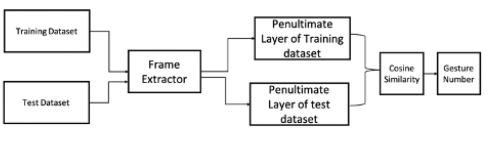

## Gesture Classification for SmartHome

Requirements:<br>
* TensorFlow
* Python 3.6.9
* OpenCV for Python
* Keras

Usage:<br>
* Training data folder: 'traindata'
* Make sure that the naming convention includes keywords for the gesture.
* Test data folder: 'test'
* Run```python main.py```
* A Results.csv will be generated in the same directory with as the project which will have the label of the predicted gestures.

Description: <br>

